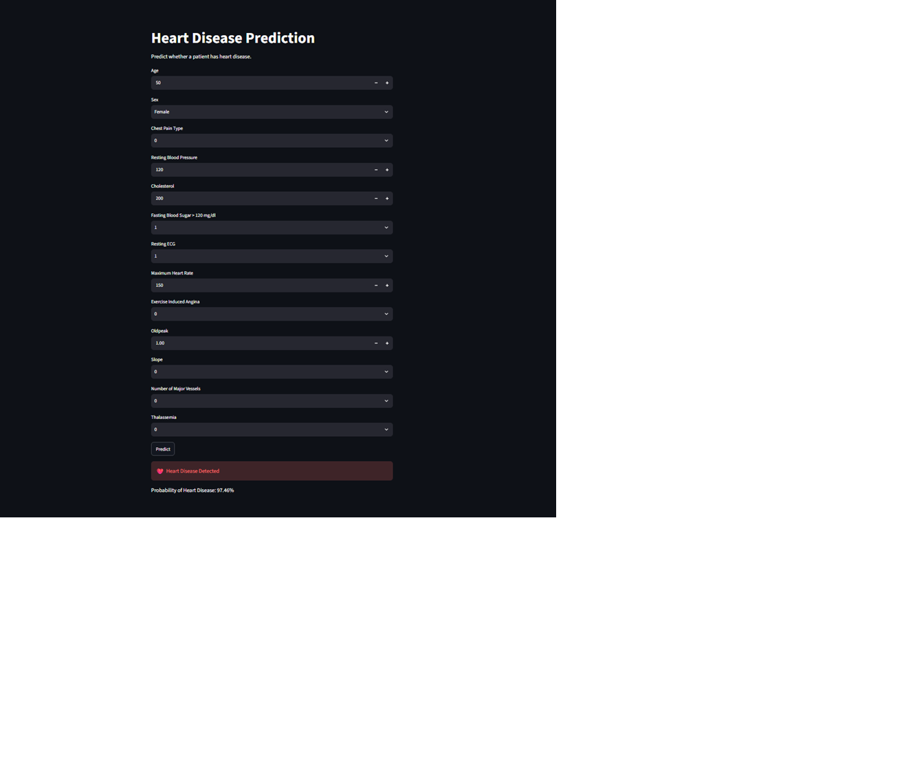
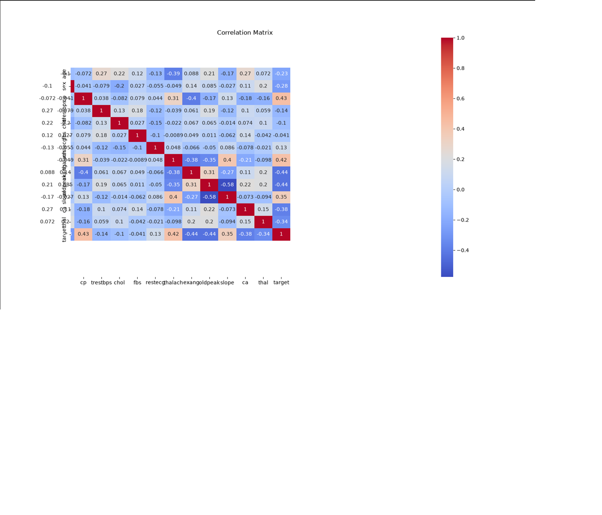
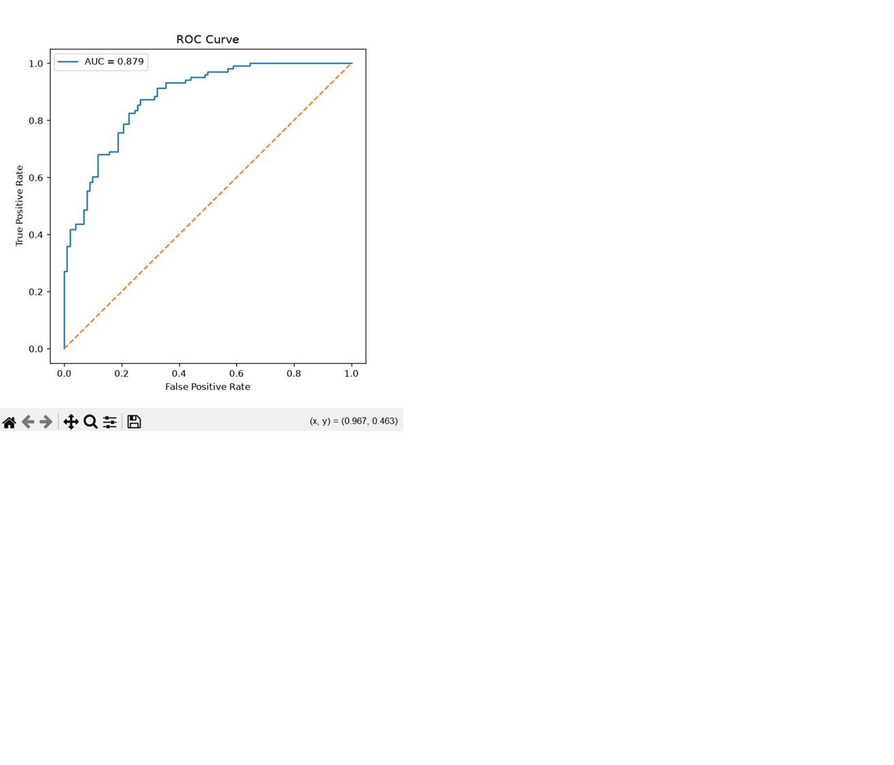

# ❤️ Heart Disease Prediction

A Machine Learning project that predicts whether a patient has heart disease based on clinical information. The model is trained using **Logistic Regression** and deployed with **Streamlit**.

## 📊 Dataset

- **Samples:** 1025
- **Features:** 13
- **Task:** Binary Classification
- **Target:**
  - `0` → No Heart Disease
  - `1` → Heart Disease

---

## 🛠 Tech Stack

- Python
- Pandas & NumPy
- Scikit-learn
- Matplotlib & Seaborn
- Streamlit
- Joblib

---

## 📈 Model Performance

| Metric | Score |
|--------|-------:|
| Accuracy | **79.51%** |
| Precision | **75.63%** |
| Recall | **87.38%** |
| F1-score | **81.08%** |

---

## 📷 Demo

### Web Application



### Correlation Matrix



### ROC Curve



---

## 🚀 Run Locally

```bash
git clone https://github.com/Loidayluii/heart-disease-prediction.git

cd heart-disease-prediction

python -m venv .venv

# Windows
.venv\Scripts\activate

pip install -r requirements.txt

streamlit run app.py
`''


## 📌 Features

- Exploratory Data Analysis (EDA)
- Feature Scaling with StandardScaler
- Logistic Regression Model
- Model Evaluation
- Interactive Streamlit Web App

